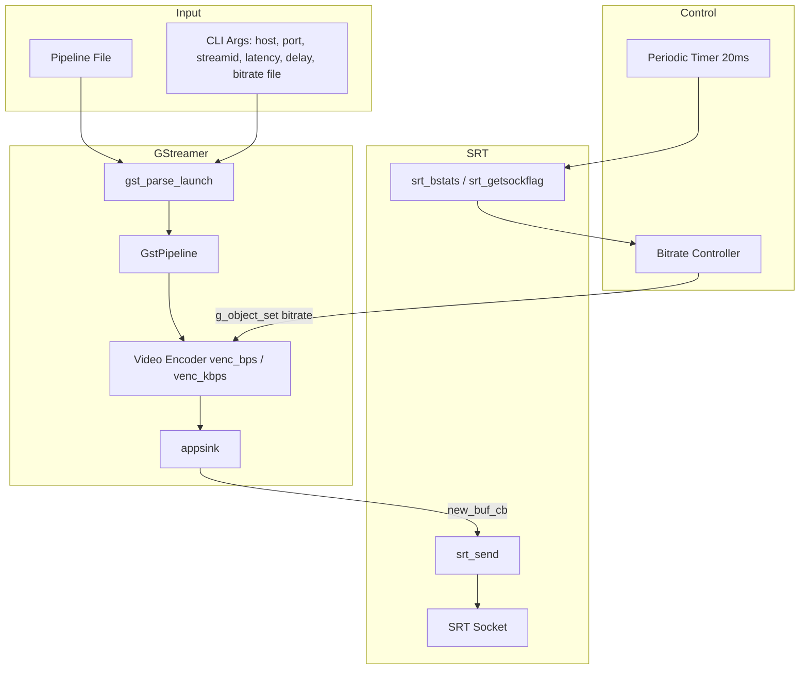

# belacoder Architecture

This document describes the high-level architecture of belacoder, a live video encoder with dynamic bitrate control and SRT streaming support.

## Overview

belacoder is a C application built on top of:

- **GStreamer** for media capture, encoding, and muxing
- **libsrt** (SRT protocol) for reliable low-latency transport over unreliable networks

The core value proposition is **adaptive bitrate control**: belacoder monitors SRT connection quality in real-time and adjusts the encoder bitrate to match available network capacity—critical for live streaming over bonded 4G/5G modems or other variable-bandwidth links.

## Repository Structure

```
belacoder/
├── belacoder.c           # Main application (GStreamer + SRT integration)
├── bitrate_control.c     # Adaptive bitrate algorithm implementation
├── bitrate_control.h     # Bitrate controller API and constants
├── Makefile              # Build system (links gstreamer + libsrt via pkg-config)
├── Dockerfile            # Container build (installs CERALIVE/srt fork)
├── camlink_workaround/   # Git submodule for Elgato Cam Link quirks
├── pipeline/             # GStreamer pipeline templates by platform
│   ├── generic/          # Software encoding (x264)
│   ├── jetson/           # NVIDIA Jetson hardware encoding (nvv4l2h265enc)
│   ├── n100/             # Intel N100 hardware encoding
│   └── rk3588/           # Rockchip RK3588 hardware encoding
└── docs/                 # Documentation (you are here)
```

## Module Overview

| Module | Files | Responsibility |
|--------|-------|----------------|
| Main | `belacoder.c` | GStreamer pipeline, SRT connection, CLI parsing, main loop |
| Bitrate Control | `bitrate_control.c/h` | Adaptive bitrate algorithm (pure logic, no GStreamer dependency) |
| Camlink Workaround | `camlink_workaround/` | USB quirks for Elgato Cam Link |

## Runtime Dataflow



### Step-by-step flow

1. **Startup**: Parse CLI arguments (host, port, stream ID, latency, bitrate file, A/V delay).
2. **Pipeline construction**: Read a GStreamer pipeline description from a text file and call `gst_parse_launch()`.
3. **Element binding**: Look up named elements:
   - `venc_bps` or `venc_kbps` → video encoder (for bitrate control)
   - `appsink` → sink that hands buffers to belacoder
   - `overlay` (optional) → text overlay for on-screen stats
   - `a_delay` / `v_delay` (optional) → identity elements for PTS adjustment
   - `ptsfixup` (optional) → smooth PTS jitter for OBS compatibility
4. **SRT connection**: Create socket, set options (latency, overhead, retransmit algo, stream ID), connect to listener.
5. **Main loop**: GLib main loop runs the pipeline; callbacks handle:
   - **`new_buf_cb`**: Called on each appsink sample. Packs MPEG-TS packets into SRT-sized chunks and calls `srt_send()`.
   - **`connection_housekeeping`** (every 20 ms): Polls SRT stats (`msRTT`, `SRTO_SNDDATA`, `mbpsSendRate`), runs the bitrate controller, and updates the encoder's bitrate property.
   - **`stall_check`** (every 1 s): Detects pipeline stalls and exits if the position hasn't advanced.
6. **Shutdown**: On SIGTERM/SIGINT, close SRT socket, clean up SRT library, unmap pipeline file, exit.

## Signal Handling

belacoder uses async-signal-safe signal handling:

- **SIGTERM/SIGINT**: Handled via `g_unix_signal_add()` which safely integrates with the GLib main loop
- **SIGHUP**: Uses a volatile flag (`reload_bitrate_flag`) that is checked in `stall_check()` to safely reload bitrate settings
- **SIGALRM**: Used as a fallback to force exit if the pipeline fails to stop gracefully

## Resource Management

All resources are properly cleaned up on exit:

- SRT socket closed via `srt_close()`
- SRT library cleaned up via `srt_cleanup()`
- Pipeline file mmap region released via `munmap()`
- GStreamer pipeline set to NULL state

## Key Abstractions

| Component | Location | Responsibility |
|-----------|----------|----------------|
| CLI parser | `belacoder.c:main()` | Parse options, validate ranges |
| Pipeline loader | `belacoder.c:main()` | Read pipeline file, call `gst_parse_launch` |
| SRT sender | `belacoder.c:new_buf_cb()` | Chunk samples into SRT packets, call `srt_send` |
| Bitrate controller | `bitrate_control.c:bitrate_update()` | Adaptive bitrate based on RTT + send buffer |
| Bitrate context | `bitrate_control.h:BitrateContext` | All algorithm state in a single struct |
| Connection monitor | `belacoder.c:connection_housekeeping()` | ACK timeout detection, stats polling |
| Stall detector | `belacoder.c:stall_check()` | Exit on pipeline stall |

## GStreamer ↔ SRT Boundary

- **GStreamer-dependent**: Pipeline parsing, element property access, buffer handling, clock queries.
- **SRT-dependent**: Socket creation, options (latency, overhead, retransmit algo, stream ID), `srt_send`, stats polling.

The only direct coupling is the `appsink` callback pulling samples and forwarding them to `srt_send()`. This makes it feasible to swap the transport layer (e.g., RIST, WebRTC) without touching GStreamer code, or to swap the media engine without touching SRT code.

## Pipeline Templates

Pipeline files are plain-text GStreamer launch strings. They must include:

| Element | Required | Purpose |
|---------|----------|---------|
| `appsink name=appsink` | Yes (for SRT output) | Hands buffers to belacoder |
| `name=venc_bps` or `name=venc_kbps` | For dynamic bitrate | Encoder with runtime-settable `bitrate` property |
| `name=overlay` | Optional | On-screen stats overlay |
| `name=a_delay` / `name=v_delay` | Optional | A/V sync adjustment |
| `name=ptsfixup` | Optional | PTS jitter smoothing |

Example (Jetson H.265 1080p30):

```
v4l2src ! identity name=ptsfixup signal-handoffs=TRUE ! identity drop-buffer-flags=GST_BUFFER_FLAG_DROPPABLE !
identity name=v_delay signal-handoffs=TRUE !
videorate ! video/x-raw,framerate=30/1 !
textoverlay text='' valignment=top halignment=right font-desc="Monospace, 5" name=overlay ! queue !
nvvidconv interpolation-method=5 ! video/x-raw(memory:NVMM),width=1920,height=1080 !
nvv4l2h265enc control-rate=1 qp-range="28,50:0,36:0,50" iframeinterval=60 preset-level=4 maxperf-enable=true EnableTwopassCBR=true insert-sps-pps=true name=venc_bps !
h265parse config-interval=-1 ! queue max-size-time=10000000000 max-size-buffers=1000 max-size-bytes=41943040 ! mux.
alsasrc device=hw:2 ! identity name=a_delay signal-handoffs=TRUE ! volume volume=1.0 !
audioconvert ! voaacenc bitrate=128000 ! aacparse ! queue max-size-time=10000000000 max-size-buffers=1000 ! mux.
mpegtsmux name=mux !
appsink name=appsink
```

## Network Bonding Integration

belacoder is designed to work with [srtla](https://github.com/CERALIVE/srtla) for network bonding:

```
┌──────────────┐      ┌─────────┐      ┌──────────┐      ┌─────────────┐
│ belacoder    │─SRT─▶│ srtla   │─────▶│ Modem 1  │─────▶│             │
│              │      │ (local) │─────▶│ Modem 2  │─────▶│ srtla_rec   │─SRT─▶ Server
│              │      │         │─────▶│ Modem 3  │─────▶│             │
└──────────────┘      └─────────┘      └──────────┘      └─────────────┘
```

When bonding multiple networks:

1. **belacoder** connects to localhost where srtla runs
2. **srtla** splits packets across multiple network interfaces
3. **srtla_rec** reassembles and forwards to the destination

The bitrate controller adapts to the **aggregate capacity** of all bonded links. SRT's RTT and buffer metrics reflect the combined network state, so belacoder automatically:
- Reduces bitrate when a modem loses signal
- Increases bitrate as aggregate capacity improves
- Maintains stable streaming despite individual link fluctuations

## See Also

- [Bitrate Control](bitrate-control.md) – Detailed algorithm description
- [Dependencies](dependencies.md) – Build and runtime requirements
