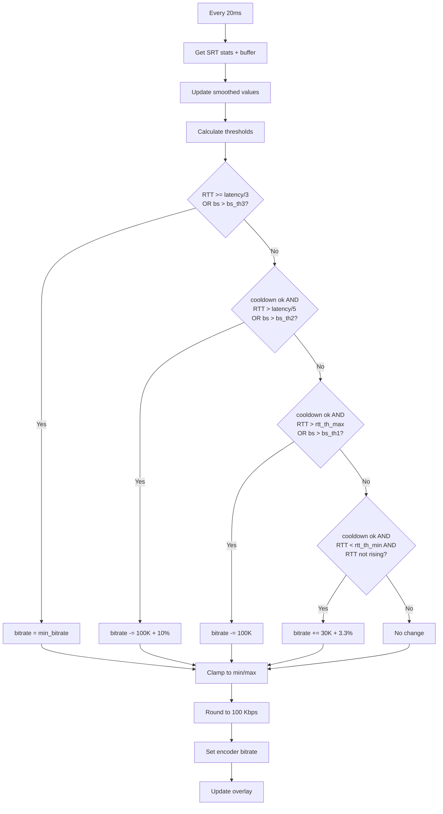

# Bitrate Control

belacoder includes a pluggable bitrate control system that adjusts the video encoder's bitrate in real-time based on network conditions.

## Available Algorithms

| Algorithm | Description | Best For |
|-----------|-------------|----------|
| `adaptive` | RTT and buffer-based control (default) | General use, mobile streaming |
| `fixed` | Constant bitrate, no adaptation | Testing, stable networks |
| `aimd` | TCP-style AIMD (Additive Increase Multiplicative Decrease) | Fair bandwidth sharing |

Select algorithm via CLI or config file:
```bash
# CLI
./belacoder -a aimd pipeline.txt host 4000

# Config file
[general]
balancer = adaptive
```

## Module Structure

All source files are in the `src/` directory:

| File | Purpose |
|------|---------|
| `src/balancer.h` | Algorithm interface (`BalancerAlgorithm` struct) |
| `src/balancer_adaptive.c` | Default adaptive algorithm |
| `src/balancer_fixed.c` | Fixed bitrate (no adaptation) |
| `src/balancer_aimd.c` | AIMD algorithm |
| `src/balancer_registry.c` | Algorithm registration and lookup |
| `src/bitrate_control.h` | Adaptive algorithm internals (BitrateContext, constants) |
| `src/bitrate_control.c` | Adaptive algorithm implementation |

## Configuration

All algorithms can be tuned via the config file:

```ini
[general]
min_bitrate = 500     # Kbps (applies to all algorithms)
max_bitrate = 6000    # Kbps

[adaptive]
incr_step = 30        # Increase step (Kbps)
decr_step = 100       # Decrease step (Kbps)
incr_interval = 500   # ms between increases
decr_interval = 200   # ms between decreases

[aimd]
incr_step = 50        # Additive increase (Kbps)
decr_mult = 0.75      # Multiplicative decrease (0.75 = reduce to 75%)
```

Reload config at runtime: `kill -HUP $(pidof belacoder)`

---

# Adaptive Algorithm Details

The default `adaptive` algorithm monitors SRT connection quality and makes decisions based on:

1. **RTT (Round-Trip Time)** from SRT statistics
2. **Send buffer occupancy** from the SRT socket
3. **Packet loss** detection
4. **Throughput estimate** from SRT statistics

The goal is to maximize video quality (high bitrate) while avoiding congestion.

## Overview

The controller runs every **20 ms** (defined by `BITRATE_UPDATE_INT`) and makes decisions based on:

1. **RTT (Round-Trip Time)** from SRT statistics
2. **Send buffer occupancy** from the SRT socket
3. **Throughput estimate** from SRT statistics

The goal is to maximize video quality (high bitrate) while avoiding congestion that would cause latency spikes or packet loss.

## Inputs

### SRT Statistics (from `srt_bstats`)

| Stat | Field | Description |
|------|-------|-------------|
| RTT | `stats->msRTT` | Current round-trip time in milliseconds |
| Send rate | `stats->mbpsSendRate` | Current send rate in Mbps |
| ACK count | `stats->pktRecvACKTotal` | Total ACKs received (for timeout detection) |

### SRT Socket Options (from `srt_getsockflag`)

| Option | Purpose |
|--------|---------|
| `SRTO_SNDDATA` | Current send buffer occupancy (packets) |
| `SRTO_PEERLATENCY` | Negotiated latency with receiver |

## BitrateContext Structure

All algorithm state is encapsulated in a `BitrateContext` struct (defined in `bitrate_control.h`):

```c
typedef struct {
    // Configuration (set once at init)
    int min_bitrate;
    int max_bitrate;
    int srt_latency;
    int srt_pkt_size;

    // Current bitrate
    int cur_bitrate;

    // Buffer size tracking
    double bs_avg;      // Rolling average (EMA_SLOW * old + EMA_FAST * new)
    double bs_jitter;   // Maximum recent increase (decays: *= EMA_SLOW)
    int prev_bs;        // Previous reading

    // RTT tracking
    double rtt_avg;       // Rolling average RTT
    double rtt_min;       // Minimum observed (slowly drifts up: *= RTT_MIN_DRIFT)
    double rtt_jitter;    // Maximum recent increase (decays: *= EMA_SLOW)
    double rtt_avg_delta; // Average RTT change rate
    int prev_rtt;         // Previous reading

    // Throughput tracking
    double throughput;    // Rolling average (converted to bps)

    // Timing for rate limiting
    uint64_t next_bitrate_incr;  // Earliest time for next increase
    uint64_t next_bitrate_decr;  // Earliest time for next decrease
} BitrateContext;
```

### API Functions

```c
// Initialize context with configuration and tuning parameters
void bitrate_context_init(BitrateContext *ctx, int min_br, int max_br,
                          int latency, int pkt_size,
                          int incr_step, int decr_step,
                          int incr_interval, int decr_interval);

// Update bitrate based on current SRT stats, returns new bitrate (rounded to 100 Kbps)
int bitrate_update(BitrateContext *ctx, int buffer_size, double rtt,
                   double send_rate_mbps, uint64_t timestamp,
                   int64_t pkt_loss_total, int64_t pkt_retrans_total,
                   BitrateResult *result);
```

Tuning parameters (pass 0 to use defaults):
- `incr_step` - Bitrate increase step (bps, default: 30000)
- `decr_step` - Bitrate decrease step (bps, default: 100000)
- `incr_interval` - Min interval between increases (ms, default: 500)
- `decr_interval` - Min interval between decreases (ms, default: 200)

## Smoothing Constants

Smoothing factors are defined as named constants in `bitrate_control.h`:

| Constant | Value | Purpose |
|----------|-------|---------|
| `EMA_SLOW` | 0.99 | Slow decay for averages and jitter |
| `EMA_FAST` | 0.01 | Fast adaptation (complement of EMA_SLOW) |
| `EMA_RTT_DELTA` | 0.8 | RTT delta smoothing |
| `EMA_THROUGHPUT` | 0.97 | Throughput smoothing |
| `RTT_MIN_DRIFT` | 1.001 | Per-sample drift rate for min RTT |
| `RTT_INITIAL` | 300 | Initial prev_rtt value |
| `RTT_MIN_INITIAL` | 200.0 | Initial rtt_min value |
| `RTT_IGNORE_VALUE` | 100 | RTT value indicating no valid measurement |

## Thresholds

The algorithm computes dynamic thresholds based on current state. Threshold multipliers are defined as named constants:

| Constant | Value | Purpose |
|----------|-------|---------|
| `BS_TH3_MULT` | 4 | Heavy congestion multiplier |
| `BS_TH2_JITTER_MULT` | 3.0 | Medium congestion jitter multiplier |
| `BS_TH1_JITTER_MULT` | 2.5 | Light congestion jitter multiplier |
| `BS_TH_MIN` | 50 | Minimum buffer threshold |
| `RTT_JITTER_MULT` | 4 | RTT jitter multiplier for rtt_th_max |
| `RTT_AVG_PERCENT` | 15 | Percentage of average for rtt_th_max |
| `RTT_STABLE_DELTA` | 0.01 | Max rtt_avg_delta for stable conditions |
| `RTT_MIN_JITTER` | 1 | Minimum jitter for rtt_th_min |

### Buffer Size Thresholds

```c
// Heavy congestion threshold (immediate drop to min)
int bs_th3 = (bs_avg + bs_jitter) * BS_TH3_MULT;

// Medium congestion threshold (fast decrease)
int bs_th2 = max(BS_TH_MIN, bs_avg + max(bs_jitter * BS_TH2_JITTER_MULT, bs_avg));
bs_th2 = min(bs_th2, RTT_TO_BS(srt_latency / 2));  // Cap at half-latency worth of packets

// Light congestion threshold (slow decrease)
int bs_th1 = max(BS_TH_MIN, bs_avg + bs_jitter * BS_TH1_JITTER_MULT);
```

Where `RTT_TO_BS(rtt)` converts RTT to packet count: `(throughput / 8) * rtt / srt_pkt_size`

### RTT Thresholds

```c
// Maximum acceptable RTT for stable operation
int rtt_th_max = rtt_avg + max(rtt_jitter * RTT_JITTER_MULT, rtt_avg * RTT_AVG_PERCENT / 100);

// Minimum RTT threshold for increasing bitrate
int rtt_th_min = rtt_min + max(RTT_MIN_JITTER, rtt_jitter * 2);
```

## Decision Logic

The controller evaluates conditions in priority order:

### 1. Emergency: Drop to Minimum (Highest Priority)

```c
if (bitrate > min_bitrate && (rtt >= srt_latency / 3 || bs > bs_th3)) {
    bitrate = min_bitrate;
    next_bitrate_decr = ctime + BITRATE_DECR_INT;  // 200 ms
}
```

**Triggers:**
- RTT exceeds 1/3 of configured latency, OR
- Send buffer exceeds `bs_th3` (4× average + jitter)

**Action:** Immediately set bitrate to `min_bitrate`.

### 2. Heavy Congestion: Fast Decrease

```c
else if (ctime > next_bitrate_decr &&
         (rtt > srt_latency / 5 || bs > bs_th2)) {
    bitrate -= BITRATE_DECR_MIN + bitrate / BITRATE_DECR_SCALE;  // 100 Kbps + 10%
    next_bitrate_decr = ctime + BITRATE_DECR_FAST_INT;           // 250 ms
}
```

**Triggers:**
- At least 250 ms since last decrease, AND
- RTT exceeds 1/5 of configured latency, OR
- Send buffer exceeds `bs_th2`

**Action:** Decrease by `100 Kbps + 10%` of current bitrate.

### 3. Light Congestion: Slow Decrease

```c
else if (ctime > next_bitrate_decr &&
         (rtt > rtt_th_max || bs > bs_th1)) {
    bitrate -= BITRATE_DECR_MIN;  // 100 Kbps
    next_bitrate_decr = ctime + BITRATE_DECR_INT;  // 200 ms
}
```

**Triggers:**
- At least 200 ms since last decrease, AND
- RTT exceeds dynamic threshold `rtt_th_max`, OR
- Send buffer exceeds `bs_th1`

**Action:** Decrease by `100 Kbps`.

### 4. Stable: Increase

```c
else if (ctime > next_bitrate_incr &&
         rtt < rtt_th_min && rtt_avg_delta < RTT_STABLE_DELTA) {
    bitrate += BITRATE_INCR_MIN + bitrate / BITRATE_INCR_SCALE;  // 30 Kbps + 3.3%
    next_bitrate_incr = ctime + BITRATE_INCR_INT;                 // 500 ms
}
```

**Triggers:**
- At least 500 ms since last increase, AND
- RTT below minimum threshold `rtt_th_min`, AND
- RTT not trending upward (`rtt_avg_delta < RTT_STABLE_DELTA`)

**Action:** Increase by `30 Kbps + ~3.3%` of current bitrate.

## Constants Summary

| Constant | Value | Purpose |
|----------|-------|---------|
| `BITRATE_UPDATE_INT` | 20 ms | Controller poll interval |
| `BITRATE_INCR_MIN` | 30 Kbps | Minimum increment step |
| `BITRATE_INCR_INT` | 500 ms | Minimum interval between increases |
| `BITRATE_INCR_SCALE` | 30 | Divisor for proportional increment (~3.3%) |
| `BITRATE_DECR_MIN` | 100 Kbps | Minimum decrement step |
| `BITRATE_DECR_INT` | 200 ms | Minimum interval for light congestion decrease |
| `BITRATE_DECR_FAST_INT` | 250 ms | Minimum interval for heavy congestion decrease |
| `BITRATE_DECR_SCALE` | 10 | Divisor for proportional decrement (~10%) |
| `MIN_BITRATE` | 300 Kbps | Absolute minimum bitrate |
| `ABS_MAX_BITRATE` | 30 Mbps | Absolute maximum bitrate |
| `DEF_BITRATE` | 6 Mbps | Default maximum bitrate |
| `DEF_SRT_LATENCY` | 2000 ms | Default SRT latency |

## Bitrate Bounds and Rounding

After computing the new bitrate, it's clamped and rounded:

```c
// Clamp to user-defined range
bitrate = min_max(bitrate, min_bitrate, max_bitrate);

// Round to nearest 100 Kbps for encoder
int rounded_br = bitrate / (100 * 1000) * (100 * 1000);
```

The internal `cur_bitrate` variable tracks the unrounded value for smoother progression.

## Overlay Display

If a `textoverlay` element named `overlay` exists in the pipeline, it displays:

```
b: XXXXX/YYYYY rtt: AAA/BBB/CCC bs: DDD/EEE/FFF/GGG
```

Where:
- `XXXXX` = set bitrate (Kbps)
- `YYYYY` = measured throughput (Kbps)
- `AAA` = current RTT (ms)
- `BBB` = `rtt_th_min`
- `CCC` = `rtt_th_max`
- `DDD` = current buffer size (packets)
- `EEE` = `bs_th1`
- `FFF` = `bs_th2`
- `GGG` = `bs_th3`

## Flowchart



## Strengths

1. **Responsive to congestion**: Multiple severity levels with appropriate reactions
2. **Stable during good conditions**: Conservative increase policy prevents oscillation
3. **Uses multiple signals**: Combines RTT and buffer occupancy for robustness
4. **Adaptive thresholds**: Thresholds adjust based on observed conditions

## Limitations and Future Improvements

1. ~~**Single algorithm**~~: ✅ Resolved - Multiple algorithms now available via `-a` flag
2. **Fixed smoothing factors**: May not adapt well to different network characteristics
3. **Latency coupling**: Thresholds tied to configured SRT latency (1/3, 1/5)
4. **No bandwidth probing**: Only increases when conditions are stable, no active probing

> **Note**: New algorithms can be added by implementing the `BalancerAlgorithm` interface
> in `balancer.h` and registering in `balancer_registry.c`.


## ACK Timeout Detection

Separately from bitrate control, `connection_housekeeping()` also implements manual ACK timeout detection:

```c
if (prev_ack_count != 0 && (ctime - prev_ack_ts) > SRT_ACK_TIMEOUT) {
    // Connection timed out, exit
}
```

Where `SRT_ACK_TIMEOUT = 6000 ms`. This compensates for SRT's timeout behavior when RTT was previously high.

## See Also

- [Architecture](architecture.md) – System overview
