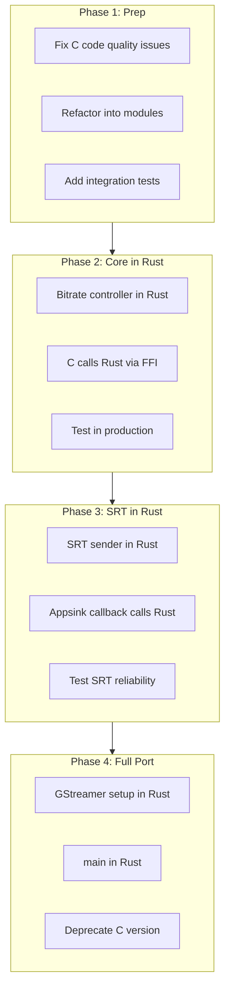

# Rust/Go Migration Feasibility Analysis

This document analyzes the feasibility of migrating belacoder from C to Rust or Go, including benefits, risks, and a recommended incremental migration path.

## Current State

belacoder is a ~800-line C application that:

1. Parses CLI arguments and a GStreamer pipeline file
2. Constructs and runs a GStreamer pipeline
3. Pulls samples from an `appsink` and sends them over SRT
4. Polls SRT statistics and adjusts encoder bitrate
5. Handles signals for graceful shutdown and config reload

### Key Dependencies

| Dependency | C Binding | Rust Binding | Go Binding |
|------------|-----------|--------------|------------|
| GStreamer | Native | `gstreamer-rs` (mature) | `go-gst` (less mature) |
| GLib | Native | `glib-rs` (mature) | Minimal |
| libsrt | Native | `srt-rs` (exists, less active) | `go-srt` (exists) |
| POSIX signals | Native | `signal-hook` (mature) | `os/signal` (native) |
| Timing | `clock_gettime` | `std::time` (native) | `time` (native) |

## Rust Migration Analysis

### Advantages

1. **Memory safety**: Eliminates use-after-free, buffer overflows, and data races at compile time
2. **Better error handling**: `Result<T, E>` forces explicit error handling
3. **No undefined behavior**: Safer signal handling, no accidental UB from misused macros
4. **Strong typing**: Catch more bugs at compile time
5. **Modern tooling**: Cargo, clippy, rustfmt, excellent IDE support
6. **Concurrency**: Fearless concurrency with ownership system

### Risks and Challenges

1. **GStreamer bindings complexity**
   - `gstreamer-rs` is mature but requires understanding GStreamer's object model
   - Callback-heavy code (like `new_buf_cb`) maps awkwardly to Rust's ownership
   - Pipeline element property access is dynamic (string-based)

2. **SRT bindings maturity**
   - `srt-rs` exists but is less actively maintained than libsrt
   - May need to use raw `libsrt-sys` bindings for some features
   - Socket options like `SRTO_SNDDATA` may not be wrapped

3. **Build complexity**
   - Need to link against GStreamer, SRT, and their C dependencies
   - Cross-compilation (for Jetson ARM) requires careful setup
   - pkg-config integration works but adds friction

4. **Team familiarity**
   - Rust has a learning curve, especially for ownership/borrowing
   - Debugging is different from C (but often easier once learned)

5. **Binary size**
   - Rust binaries are larger than C equivalents
   - May matter for embedded deployments (Jetson, RK3588)

### Rust Migration Effort Estimate

| Component | Complexity | Estimated Effort |
|-----------|------------|------------------|
| CLI parsing | Low | 2-4 hours |
| Pipeline construction | Medium | 1-2 days |
| Appsink callback + SRT send | Medium | 1-2 days |
| Bitrate controller | Low | 4-8 hours |
| Signal handling | Low | 2-4 hours |
| Testing + debugging | High | 2-3 days |
| **Total** | | **1-2 weeks** |

### Recommended Rust Crates

```toml
[dependencies]
gstreamer = "0.22"
gstreamer-app = "0.22"
glib = "0.19"
clap = "4"           # CLI parsing
anyhow = "1"         # Error handling
signal-hook = "0.3"  # Signal handling
libc = "0.2"         # Low-level POSIX
log = "0.4"          # Logging facade
env_logger = "0.11"  # Logging implementation

[build-dependencies]
pkg-config = "0.3"   # Find GStreamer, SRT

# SRT bindings - may need custom or raw bindings
# srt-rs = "0.x" or libsrt-sys = "0.x"
```

## Go Migration Analysis

### Advantages

1. **Simpler than Rust**: No borrow checker, faster to learn
2. **Good concurrency**: Goroutines and channels are excellent
3. **Fast compilation**: Much faster than Rust
4. **Static binaries**: Easy deployment (with caveats for CGO)
5. **Native networking**: Go's net package is excellent
6. **Cross-compilation**: Built-in, but CGO complicates it

### Risks and Challenges

1. **GStreamer bindings immaturity**
   - `go-gst` exists but is less mature than `gstreamer-rs`
   - May have missing or buggy functionality
   - GObject integration is awkward in Go

2. **CGO overhead and complexity**
   - Calling C from Go has overhead (~100ns per call)
   - For 50 FPS video (20ms frames), this adds up
   - CGO breaks cross-compilation simplicity
   - Memory management across Go/C boundary is error-prone

3. **No SRT pure-Go implementation**
   - Must use CGO bindings to libsrt
   - Same cross-compilation issues as GStreamer

4. **Garbage collection**
   - GC pauses could theoretically affect real-time performance
   - Modern Go GC is quite good, but worth monitoring

5. **Less common for media applications**
   - Rust and C++ are more common in media/streaming
   - Smaller community for media-related Go libraries

### Go Migration Effort Estimate

| Component | Complexity | Estimated Effort |
|-----------|------------|------------------|
| CLI parsing | Low | 2-4 hours |
| Pipeline construction | High | 2-3 days |
| Appsink callback + SRT send | High | 2-3 days |
| Bitrate controller | Low | 4-8 hours |
| Signal handling | Low | 1-2 hours |
| Testing + debugging | High | 2-3 days |
| **Total** | | **1.5-2.5 weeks** |

### Recommended Go Packages

```go
import (
    "github.com/go-gst/go-gst/gst"     // GStreamer bindings
    "github.com/go-gst/go-gst/gst/app" // appsink/appsrc
    // SRT: need to find or write CGO bindings
    "github.com/spf13/cobra"           // CLI
    "log/slog"                         // Structured logging (Go 1.21+)
)
```

## Comparison Matrix

| Factor | Stay C | Migrate to Rust | Migrate to Go |
|--------|--------|-----------------|---------------|
| Memory safety | Manual | Compile-time | Runtime (GC) |
| Error handling | Manual | Enforced | Convention |
| GStreamer support | Native | Good (`gstreamer-rs`) | Fair (`go-gst`) |
| SRT support | Native | Fair (`srt-rs`) | Requires CGO |
| Build complexity | Low | Medium | Medium (CGO) |
| Cross-compilation | Established | Possible | Harder (CGO) |
| Performance | Baseline | Same or better | Slight overhead |
| Binary size | Smallest | Larger | Larger |
| Learning curve | Existing | Steep | Moderate |
| Team velocity (long-term) | Baseline | Higher | Higher |
| Maintenance burden | Higher | Lower | Lower |

## Recommendation

### Short-term (0-6 months): Stay with C

The current codebase works and is deployed. Focus on:

1. Fixing critical safety issues (signal handling, error handling)
2. Improving documentation (this effort)
3. Refactoring into cleaner modules
4. Adding tests

### Medium-term (6-12 months): Evaluate Rust Incrementally

If considering a rewrite:

1. **Start with the bitrate controller** in Rust
   - Self-contained, no GStreamer dependency
   - Easy to test in isolation
   - Can be called from C via FFI

2. **Add SRT sender module** in Rust
   - Test SRT bindings maturity
   - Evaluate performance

3. **Evaluate GStreamer bindings**
   - Build a simple test pipeline
   - Verify appsink callback works correctly

4. **Full port only if incremental modules succeed**

### Why Rust over Go?

For this specific application:

1. **GStreamer bindings are more mature** in Rust
2. **No GC latency concerns** for real-time video
3. **Better safety guarantees** for low-level SRT socket handling
4. **More common in media/streaming** ecosystem
5. **Performance parity with C** is guaranteed

Go would be a reasonable choice if:
- Team is already proficient in Go
- GStreamer bindings improve significantly
- Willing to write/maintain CGO bindings for SRT

## Incremental Migration Path (Rust)



### Phase 1: Preparation (C, 1-2 weeks)

- Fix signal handling safety
- Add proper error handling
- Refactor into logical modules
- Add integration test harness
- Document all interfaces

### Phase 2: Core Modules in Rust (2-3 weeks)

- Create Rust crate for bitrate controller
- Implement controller interface
- Expose via C FFI (`extern "C"`)
- Integrate into C main, test in production
- Verify no regressions

### Phase 3: SRT in Rust (2-3 weeks)

- Evaluate/extend `srt-rs` bindings
- Implement SRT sender module
- Wire up appsink callback to call Rust
- Test reliability and performance

### Phase 4: Full Port (3-4 weeks)

- Implement GStreamer pipeline construction in Rust
- Port main loop and signal handling
- CLI parsing (use `clap`)
- Deprecate C version
- Update build system and documentation

### Total Incremental Migration: 8-12 weeks

Spread over 6-12 months with production testing between phases.

## Alternatives to Full Rewrite

### 1. Keep C, Improve Quality

- Fix the issues in [code-quality-and-risks.md](code-quality-and-risks.md)
- Add tests, documentation, static analysis
- Lower risk, lower effort
- Still have memory safety concerns

### 2. Hybrid: Rust Modules via FFI

- Keep C for GStreamer glue
- Rust for bitrate controller and SRT sender
- Best of both worlds
- More complex build, but lower risk than full port

### 3. Different Architecture: Separate Processes

- GStreamer pipeline in one process (C/Python/etc.)
- SRT sender + controller in another (Rust/Go)
- Communicate via pipes, shared memory, or local socket
- More latency, but full isolation

## Conclusion

A full migration to Rust is **feasible but not urgent**. The recommended approach is:

1. **Now**: Fix critical C issues and improve documentation
2. **Soon**: Refactor C code into cleaner modules with tests
3. **Later**: Incrementally port modules to Rust, starting with bitrate controller
4. **Eventually**: Full Rust port if incremental modules succeed

Go is a viable alternative if the team prefers it, but GStreamer binding maturity and CGO complexity make Rust a better fit for this media-focused application.

## See Also

- [Architecture](architecture.md) – Current system design
- [Code Quality and Risks](code-quality-and-risks.md) – Issues to fix before/during migration
- [Bitrate Control](bitrate-control.md) – First candidate for Rust port
